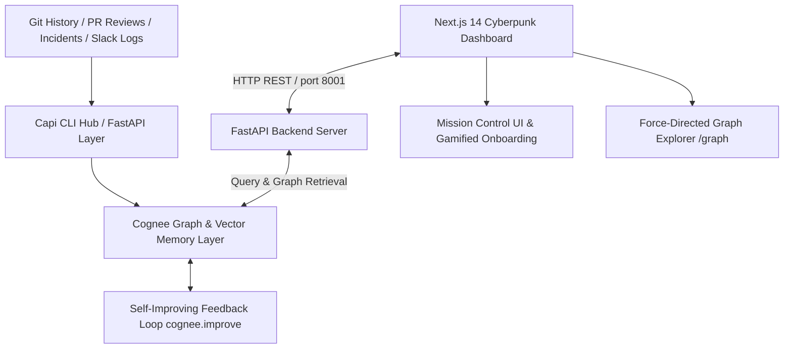

# 💡 Capi (Config Archaeology)
> **Autonomous AI Configuration Guardrails & Self-Improving Provenance Knowledge Graph**
> Built with Cognee Graph Memory Layer, FastAPI, Next.js 14 (App Router), Tailwind CSS, and shadcn/ui.

[](https://opensource.org/licenses/MIT)
[](https://github.com/topoteretes/cognee)
[](https://nextjs.org)
[](https://fastapi.tiangolo.com)
[]()

Every engineering team has configuration files full of mystery values (`DB_POOL_SIZE=10`, `REQUEST_TIMEOUT=30000`, `MAX_RETRIES=3`). Nobody knows why they exist or what breaks if they change. Engineers check `git blame` (which only shows "fix config" by someone who left 8 months ago), search Slack (nothing), and make a judgment call. They deploy—and production crashes.

**Capi solves configuration drift and mystery values forever.** It is a self-improving memory layer that ingests Git commit history, GitHub Pull Requests, Slack incident threads, and post-mortems into a **Cognee hybrid vector-relational knowledge graph**. It allows engineers to query any configuration value and immediately get full provenance—who set it, why it was changed, what historical outages it caused, and whether it is safe to redeploy.

---

## ✨ Key Features & Hangover Cyberpunk UI

- **🎮 Level 1 Gamified Onboarding Mission**: An interactive, terminal-style quickstart that guides developers through selecting target microservices (`payments-api`, `billing-service`, `auth-gateway`), choosing investigation weapons, and clicking instant **Try-Me Tags**.
- **🔍 Config Archaeology & Provenance Engine**: Query any config key (`DB_POOL_SIZE`, `CACHE_TTL`, `WORKER_THREADS`) to unearth historical git blame, PR review reasoning, and past P1 outage post-mortems.
- **🌌 Interactive Force-Directed Graph Explorer**: A dedicated 2D physics graph (`react-force-graph-2d`) rendering microservice dependencies, commit diffs, pull requests, and outage blast radiuses in real time.
- **🔄 Self-Improving Feedback Loops (`cognee.improve`)**:
  - **🚨 Negative Feedback (Outage Reports)**: Instantly penalizes a variable's Danger Score (`+20`) in graph memory when an outage occurs so no engineer repeats the mistake.
  - **✅ Positive Feedback (Safe Deployments)**: Rewards clean deployments by reducing the Danger Score (`-10`), keeping risk metrics accurate over time.
- **🛡️ Batch `.env` File Codebase Audit**: Paste any `.env` file from your local workflow or CI/CD pipeline to scan every single variable in batch against historical memory before committing!
- **⚡ Offline-Resilient & Fast**: Heuristic fallback checks prevent LLM network latency from stalling UI interactions, ensuring <1s response times.

---

## 🏗️ System Architecture



---

## 🚀 Quickstart Guide

### Prerequisites
- **Python**: v3.10+ (tested with virtual environments)
- **Node.js**: v18+ / **Bun** or **npm**

### 1. Backend Setup & Configuration
Clone the repository and install backend dependencies:
```bash
# In project root
python3 -m venv venv
source venv/bin/activate
pip install -r requirements.txt
```

Set up your `.env` configuration file in the project root:
```env
# Cognee Configuration Mode (local open-source or cloud)
COGNEE_MODE=local
COGNEE_API_KEY=your_cognee_api_key_here

# LLM Provider Keys
LLM_PROVIDER=groq
LLM_API_KEY=your_groq_or_openai_api_key_here
LLM_MODEL=groq/llama-3.3-70b-versatile
```

Start the FastAPI backend server:
```bash
./capi serve
# Or manually:
./venv/bin/uvicorn main:app --host 0.0.0.0 --port 8001
```
The REST API server will run on `http://localhost:8001`.

### 2. Next.js 14 Dashboard Setup
In a new terminal window, start the frontend web interface:
```bash
cd dashboard
bun install   # or npm install
bun run dev   # or npm run dev
```
Open your browser to **[http://localhost:3000](http://localhost:3000)** to launch Mission Control!

---

## 🛠️ CLI Reference (`./capi`)

Capi includes a unified command-line tool in the root directory for workflow integration:

```bash
# Query config provenance from terminal
./capi query DB_POOL_SIZE --service payments-api

# Start the REST API server on port 8001
./capi serve

# Run interactive CLI help
./capi --help
```

---

## 📡 REST API Reference Table (Port 8001)

| Endpoint | Method | Description | Payload / Params |
| :--- | :---: | :--- | :--- |
| `/query` | `POST` | Perform config archaeology scan on a variable | `{"key": "DB_POOL_SIZE", "service": "payments-api"}` |
| `/incident` | `POST` | Record outage & trigger negative feedback (`+20` risk) | `{"key": "...", "service": "...", "notes": "...", "severity": "P1"}` |
| `/safe` | `POST` | Record clean deployment & trigger positive feedback (`-10` risk) | `{"key": "...", "service": "..."}` |
| `/graph` | `GET` | Fetch nodes and links for 2D force graph explorer | `?service=payments-api` |
| `/health` | `GET` | Check engine connection status & Cognee memory readiness | None |

---

## 🌐 Cognee Cloud vs. Open Source Mode

Capi is built to support both local development and enterprise cloud deployments:
- **Local Open Source Mode (`COGNEE_MODE=local`)**: Uses local SQLite vector and relational storage for lightning-fast, zero-cost developer workflows and offline resilience.
- **Cognee Cloud Mode (`COGNEE_MODE=cloud`)**: Seamlessly connects to Cognee Cloud managed graph databases by setting `COGNEE_API_KEY` in `.env`, enabling multi-team graph synchronization across distributed CI/CD pipelines.

---

## 🏆 Designed for Advanced Agentic & Human Workflows
Built by team Capi to demonstrate how AI memory layers transform engineering culture from reactive firefighting to autonomous, self-improving configuration guardrails.
