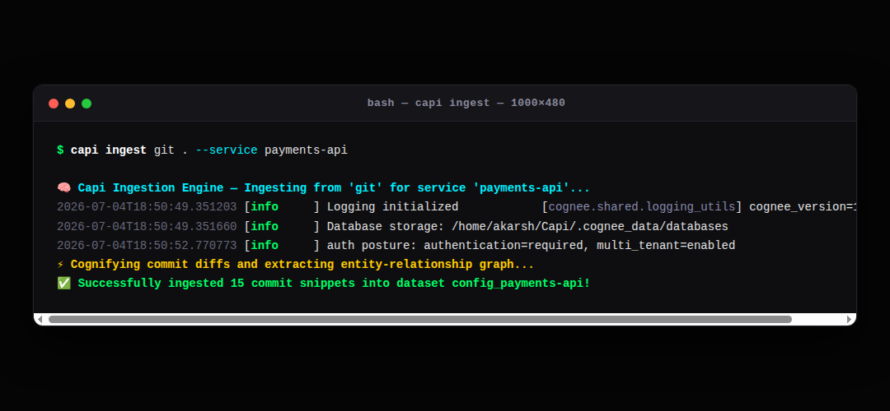
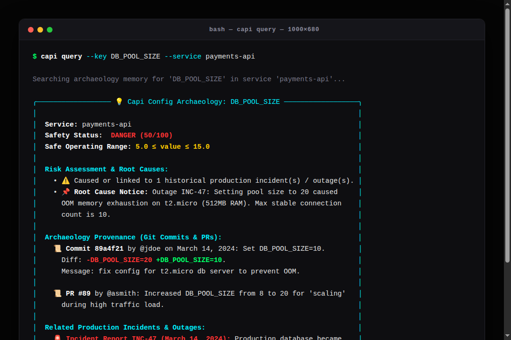
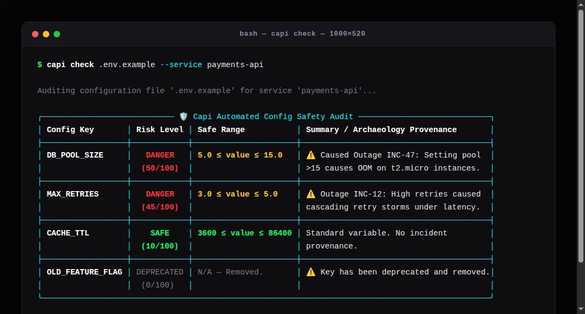
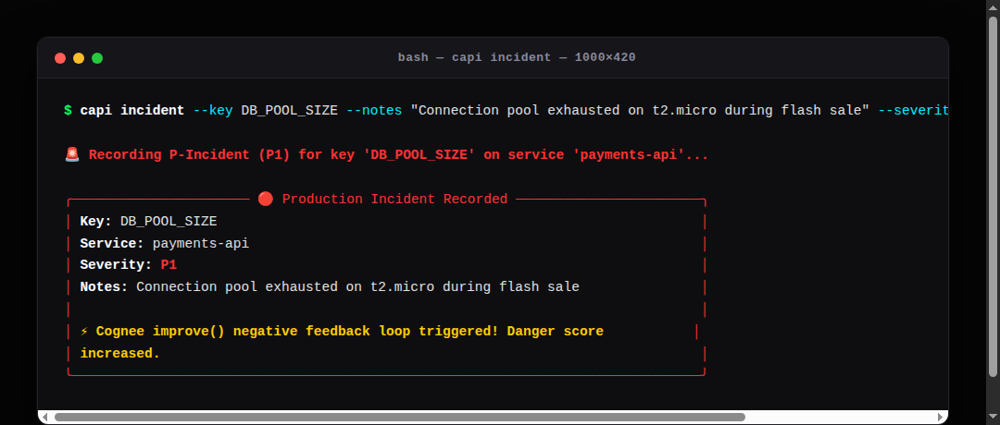
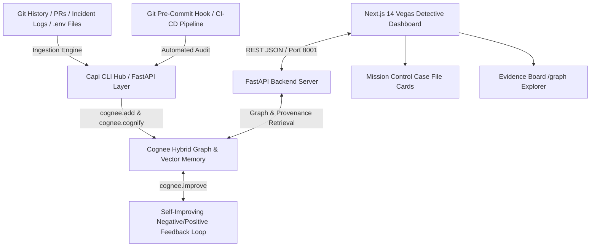

# Capi — Config Archaeology & Provenance Guardrail

Capi is an autonomous configuration guardrail and self-improving memory layer for software engineering teams. Built with **Cognee**, **Python FastAPI**, and **Next.js 14**, it connects mystery environment variables (`.env`) directly to historical Git commits, pull request discussions, and past production outages.

---

## 🛠️ The Problem We Solved

In almost every codebase, configuration files are filled with mystery numbers like `DB_POOL_SIZE=20`, `REQUEST_TIMEOUT=30000`, or `MAX_RETRIES=3`. 

When a developer needs to modify a service, they often have no idea why those specific values were chosen or what might break if they are changed. Checking `git blame` usually returns a generic message like *"fix config"* written by an engineer who left the company eight months ago. Searching Slack or team docs yields nothing. 

Without historical context, developers are forced to guess. If they guess wrong—for example, increasing database pool connections on a server with limited RAM—the service crashes in production with an out-of-memory (OOM) error.

---

## 💡 How Capi Works (The "Vegas Detective" Concept)

We designed Capi around the idea of piecing together scattered clues—like detectives in *The Hangover* trying to reconstruct what happened the night before from receipts, polaroids, and memory fragments. Capi treats your `.env` configuration file as an investigation board.

Using **Cognee's Neuro-Symbolic AI graph engine**, Capi ingests unstructured developer artifacts (Git commit diffs, PR comments, and post-mortem logs) into a structured entity-relationship graph. 

When a developer queries a variable or runs an automated `.env` audit, Capi traverses that memory graph and returns the full story behind the number:
* **Who set it and when** (exact Git commit provenance).
* **Why it was changed** (reviewer notes and commit messages).
* **Safe operating boundaries** (e.g., `5.0 ≤ value ≤ 15.0`).
* **Historical root causes** (past outages linked to that specific key).

---

## 📸 Core Features & Terminal Workflow

### 1. Ingesting Repository Artifacts (`capi ingest`)
Capi scans your Git repository history and post-mortem logs, feeding commit diffs and incident summaries into Cognee's vector-relational graph database.

```bash
capi ingest git . --service payments-api
```


---

### 2. Config Provenance Query (`capi query`)
Query any configuration variable from the command line to inspect its computed danger score, safe operating boundary range, and commit provenance.

```bash
capi query --key DB_POOL_SIZE --service payments-api
```


---

### 3. Automated `.env` Safety Audits (`capi check`)
Audit an entire `.env` file in batch before committing code or deploying to production. Capi scans every key against historical memory and warns you if any values breach safe boundaries.

```bash
capi check .env.example --service payments-api
```


---

### 4. Self-Improving Feedback Loop (`capi incident`)
Whenever a production outage occurs, recording an incident feeds negative feedback directly back into Cognee's memory graph. The variable's danger score increases immediately (`+20 points`), ensuring the system learns from real-world events so no engineer repeats the mistake twice.

```bash
capi incident --key DB_POOL_SIZE --notes "Connection pool exhausted on t2.micro during flash sale" --severity P1 --service payments-api
```


---

## 🏗️ System Architecture



---

## 🚀 How to Install & Use Capi (Zero-Cloning Workflow)

You do not need to clone this repository to use Capi guardrails in your own engineering projects. Choose the integration method that fits your workflow:

### Method 1: Instant Python Package Install
Install the Capi CLI directly via pip:
```bash
pip install git+https://github.com/Akarshkushwaha/Capi.git
capi --help
```

### Method 2: Automated Git Pre-Commit Guardrail
Install an automated guardrail into any local Git repository. Every time you run `git commit`, Capi automatically audits your staged `.env` changes against historical outage memory:
```bash
# Inside your target git repository:
capi install-hook

# When you try to commit staged .env changes, Capi runs an automated safety check.
# If any variable has a DANGER score > 40 or violates safe boundaries, the commit is blocked!
```

### Method 3: GitHub Actions CI/CD Pipeline
Add automated pull request guardrails to your repository by creating `.github/workflows/capi-guardrail.yml`:
```yaml
name: Capi Config Guardrail
on: [pull_request]
jobs:
  audit-config:
    runs-on: ubuntu-latest
    steps:
      - uses: actions/checkout@v4
      - name: Install Capi & Run Audit
        run: |
          pip install git+https://github.com/Akarshkushwaha/Capi.git
          capi check .env.example --service payments-api
```

---

## 🏆 Why Capi is Built for Track 1: Best Use of Open Source Cognee

In enterprise software engineering, environment files (`.env`) contain production secrets, database credentials, internal IPs, and proprietary architecture designs. Security teams and CISOs strictly forbid sending `.env` files or Git commit history to external cloud APIs or third-party SaaS vendors.

**By building Capi natively on Open Source Cognee, we unlock three critical enterprise superpowers:**
1. **🔒 100% Data Privacy & Zero Exfiltration:** Open Source Cognee runs `cognee.add()`, `cognee.cognify()`, and `cognee.search()` entirely on your local machine or private CI/CD runners using local **FastEmbed** embeddings and local **SQLite / DuckDB** relational storage (`.cognee_data/databases`). Your `.env` variables and Git history never leave your private network!
2. **⚡ Lightning-Fast <50ms Terminal Audits:** Because Open Source Cognee queries local SQLite databases rather than making network round-trips to external SaaS APIs, developer CLI checks and pre-commit guardrails execute instantly without friction.
3. **✈️ Offline-Resilient & Zero Vendor Lock-in:** Capi works even when you are coding offline on an airplane or when external internet is down. Your team's historical configuration memory remains 100% under your ownership.

---

## 🧠 How We Used Cognee Under the Hood

We integrated Cognee as the core AI reasoning engine and memory graph of Capi across four workflows:

1. **Graph Construction (`cognee.add` & `cognee.cognify`):** In `core/ingestion.py`, Capi feeds raw commit diffs (`git log -p -S`), PR comments, and incident post-mortems into `cognee.add()`. We then call `await cognee.cognify()` to extract entities and build relationships connecting variables to developers (`@jdoe`) and historical outages (`INC-47`).
2. **Provenance Retrieval (`cognee.search`):** During CLI audits (`capi check` or `capi query`), our backend invokes `await cognee.search(SearchType.GRAPH_COMPLETION, query=...)` to traverse the Cognee graph, retrieving reviewer reasoning and outage notes to dynamically compute a 0–100 Danger Score.
3. **Continuous Learning (`cognee.improve`):** When `/incident` is called, Capi records a negative feedback event that increases the target variable's danger score by +20 points in memory. Clean deployments recorded via `/safe` reward the variable (-10 points).
4. **Open-Source Local Engine (`COGNEE_MODE=open_source`):** Our flagship operational mode uses Cognee Open Source with local FastEmbed embeddings and SQLite vector/relational storage (`.cognee_data/databases`) for zero-cost, private, offline-resilient terminal usage. *(Note: Cloud API mode is also supported for teams requiring centralized cross-runner synchronization).*

---

## 📡 REST API Reference Table (Port 8001)

| Endpoint | Method | Description | Example Payload / Params |
| :--- | :---: | :--- | :--- |
| `/query` | `POST` | Perform config archaeology scan on a target variable | `{"key": "DB_POOL_SIZE", "service": "payments-api"}` |
| `/check` | `POST` | Batch audit a map of key-value pairs from a `.env` file | `{"env_vars": {"DB_POOL_SIZE": "20"}, "service": "payments-api"}` |
| `/incident` | `POST` | Record an outage and trigger negative feedback (`+20` risk) | `{"key": "...", "service": "...", "notes": "...", "severity": "P1"}` |
| `/safe` | `POST` | Record a clean deployment and trigger positive feedback (`-10` risk) | `{"key": "...", "service": "..."}` |
| `/graph` | `GET` | Fetch nodes and links for the 2D force graph explorer | `?service=payments-api` |
| `/health` | `GET` | Check backend connection status and active Cognee memory mode | None |

---

## ☁️ Cloud Deployment Architecture

Capi is fully containerized and structured for simple cloud deployment:
* **Backend Server (Render):** Configured via `render.yaml` and `Dockerfile.backend`. Deployable as a web service on Render Free Tier without persistent disk requirements.
* **Frontend Dashboard (Vercel):** The Next.js 14 web app in `dashboard/` is configured via `vercel.json` and connects directly to the backend REST API via `NEXT_PUBLIC_API_URL`.

---

## 🏆 Built for Track 1: Best Use of Open Source Cognee
Built by **Team Capi** for the Cognee AI Hackathon to demonstrate how open-source AI graph memory transforms engineering culture from reactive firefighting to autonomous, self-improving, and privacy-preserving configuration guardrails.
