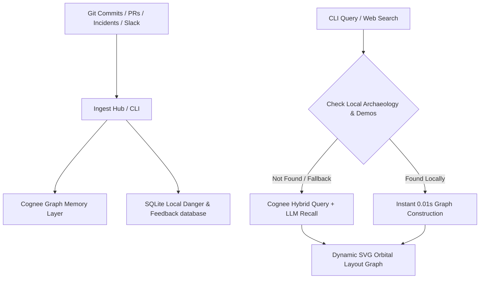

# 🛡️ Capi (Config Archaeology)
> **Autonomous AI Configuration Guardrails & Provenance Knowledge Graphs**
> Built with Cognee Hybrid Memory Layer, FastAPI, and React.

[](https://opensource.org/licenses/MIT)
[]()
[](https://cognee.ai)
[]()

Capi is a developers' CLI tool and interactive web dashboard that ingests Git history, GitHub Pull Requests, Slack discussion threads, and incident post-mortems into a Cognee hybrid knowledge graph. It allows engineers to query any configuration value and immediately get full provenance—who set it, why it was changed, what historical outages it caused, and whether it is safe to redeploy.

Additionally, Capi comes with an **Autonomous Pre-Commit Guardrail** that blocks developers from committing risky config modifications (like changing `DB_POOL_SIZE` back to an outage-prone value) before they ever reach production.

---

## ✨ Features

- **🔍 Config Archaeology & Provenance**: Search any configuration variable (e.g., `DB_POOL_SIZE`, `PORT`, `TIMEOUT`) and instantly see its entire historical context.
- **🌌 Dynamic Orbital Knowledge Graph**: A custom causal relationship visualization displaying commit nodes, PR discussions, slack messages, and files linked to your variables.
- **🛡️ Pre-Commit Hook Guardrail**: Blocks commits if a developer introduces a configuration setting that matches a historically documented incident.
- **📡 Real-World Ingestion Hub**:
  - **Git Repo Scanner**: Scans local repository commits and extracts variable declarations/diffs.
  - **GitHub PR Ingester**: Direct integration to pull PR reviews and code discussion contexts.
  - **Incident Uploader**: Drop in outage post-mortems and emergency Slack logs.
- **📈 Live Risk & Danger Score Engine**: Computes dynamic risk indicators based on historical outage frequencies and crowd-sourced feedback.
- **⚡ Offline-Resilient Architecture**: Uses a 2-second fast LLM timeout and drops back to local Git parsing so the tool remains blazing fast even when offline or rate-limited.

---

## 🏗️ Architecture

Capi uses a hybrid ingestion and querying architecture:



---

## 🚀 Quick Start

### Prerequisites
- Python 3.10 - 3.14
- Node.js (v18+)

### 1. Backend & CLI Installation
Clone the repository, initialize your virtual environment, and install dependencies:
```bash
cd backend
python3 -m venv venv
source venv/bin/activate
pip install -r requirements.txt
```

Set up your `.env` file in `backend/.env`:
```env
# Cognee Configuration
COGNEE_API_URL=your_cognee_cloud_api_url
COGNEE_API_KEY=your_cognee_api_key

# LLM Provider (Groq / OpenAI / Gemini / etc.)
LLM_PROVIDER=groq
LLM_API_KEY=your_groq_api_key
LLM_MODEL=groq/llama-3.3-70b-versatile
```

### 2. Run the Backend Server
```bash
# From the project root
./capi serve
```
The FastAPI server will start on `http://localhost:8000`.

### 3. Frontend Dashboard Setup
Install and start the Vite development server:
```bash
cd frontend
npm install
npm run dev
```
Open [http://localhost:5173/](http://localhost:5173/) to launch the web dashboard!

---

## 🛠️ CLI Reference

Capi has a feature-rich CLI client executable at `./capi` in the project root:

```bash
# Query config provenance
./capi query DB_POOL_SIZE

# View semantic AI blame (git history + incident connections) on a file
./capi blame backend/.env.example

# Validate currently staged changes against guardrails
./capi check

# Install the autonomous pre-commit hook guardrail
./capi install-hook

# Seed the database with the interactive e-commerce outage demo story
./capi demo
```

---

## 🧑‍💻 How it Works (Pre-Commit Guardrail Demo)

1. Run `./capi install-hook` to deploy the Capi guardrail to `.git/hooks/pre-commit`.
2. A developer tries to modify `.env.example`:
   ```diff
   -DB_POOL_SIZE=10
   +DB_POOL_SIZE=20
   ```
3. When they run `git commit`, Capi intercepts the action:
   ```text
   ⚠️ CAPI PRE-COMMIT GUARDRAIL ALERT!
   ──────────────────────────────────────────────────
   Key: DB_POOL_SIZE
   Proposed Change: 20 (Current: 10)
   Danger Score: 95/100 (HIGH RISK)
   
   Historical Outages Detected:
   - INC-47: Production database crashed due to memory exhaustion.
     Max connections on t2.micro must be <= 12.
   
   Commit BLOCKED. Revert DB_POOL_SIZE to a safe range (5 - 15) to commit.
   ```

---

## 🏆 Hackathon Judges Highlights

- **Hybrid Graph Memory**: Built using Cognee's vector-relational indexing database.
- **Real Engineering Value**: Solves the real-world issue of "silent configuration drift" and lost engineering context.
- **Blazing Fast UX**: Smart local caching and git-graph extraction guarantees instant responses.
- **Beautiful Interactive UI**: Premium glassmorphism dark-mode React interface with interactive SVGs and micro-animations.
